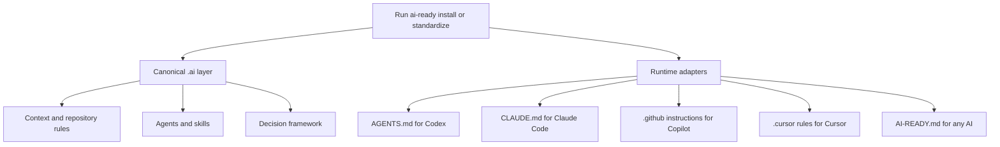
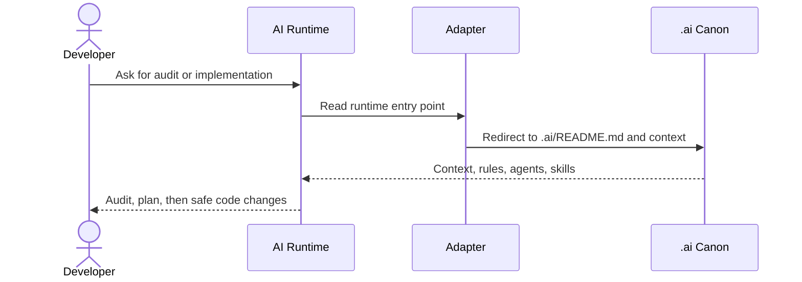

# AI-Ready Bootstrap

Bootstrap, audit, and standardize a canonical AI layer in an existing software repository.

Private repo: `iMark21/ai-ready-bootstrap`

## Core Model

- `.ai/` is always the canonical layer
- you choose one, two, or several runtimes explicitly
- runtime adapters stay thin and point back to `.ai/`
- `generic` installs `AI-READY.md` as a universal adapter for any AI tool
- `all` expands to `codex,claude,copilot,cursor,generic`

This is designed for teams that need a repeatable AI-Ready setup whether the target repo is Android, iOS, web, backend, or still undefined.

## Why A CLI Instead Of Only A Skill

A skill is not enough for repo bootstrap.

You need a tool that can:

- work even when the repo has no AI setup at all
- audit before changing anything
- standardize mixed legacy AI files into one canon
- install only the adapters a team actually uses
- hand off a repo to teammates who do not use the same AI runtime

## Commands

```bash
# Read-only inspection
bin/ai-ready audit /path/to/repo

# Fresh install
bin/ai-ready install /path/to/repo \
  --runtimes codex,claude,generic \
  --project-type android

# Normalize an existing setup
bin/ai-ready standardize /path/to/repo \
  --runtimes all \
  --yes
```

## Project Types

| Project Type | Detection Hints | Primary Rules Generated |
| --- | --- | --- |
| `android` | `settings.gradle`, `settings.gradle.kts`, `AndroidManifest.xml` | `.ai/rules/kotlin.md`, `.ai/rules/compose.md` |
| `ios` | `.xcodeproj`, `.xcworkspace`, `Package.swift`, `Podfile` | `.ai/rules/swift.md`, `.ai/rules/swiftui.md` |
| `web` | `package.json`, `pnpm-lock.yaml`, `yarn.lock` | `.ai/rules/typescript.md`, `.ai/rules/react.md` |
| `backend` | `go.mod`, `Cargo.toml`, `pyproject.toml` | `.ai/rules/code.md`, `.ai/rules/ui.md` |
| `generic` | fallback when nothing else matches | `.ai/rules/code.md`, `.ai/rules/ui.md` |

The iOS path is first-class: the generated guidance is Swift/SwiftUI-oriented and explicitly calls out state ownership, structured concurrency, `@MainActor`, UIKit boundaries, and preview/sample-data expectations.

## Runtime Targets

| Runtime | Adapter |
| --- | --- |
| `codex` | `AGENTS.md` |
| `claude` | `CLAUDE.md` |
| `copilot` | `.github/copilot-instructions.md` plus `.github/instructions/` |
| `cursor` | `.cursor/rules/ai-ready.mdc` |
| `generic` | `AI-READY.md` |

`generic` is the universal mode. Use it when:

- the AI tool has no native repo instruction format
- you want one cross-runtime handoff file
- the team has not decided yet which assistant will own the repo

You can combine `generic` with any runtime-specific adapter.

## What It Generates

Canonical files:

- `.ai/README.md`
- `.ai/context.md`
- `.ai/context/architecture.md`
- `.ai/context/dependencies.md`
- `.ai/context/features.md`
- `.ai/context/repository.md`
- `.ai/context/recent-changes.md`
- `.ai/decision-framework.md`
- `.ai/rules/`
- `.ai/agents/`
- `.ai/skills/`

Optional adapters:

- `AGENTS.md`
- `CLAUDE.md`
- `.github/copilot-instructions.md`
- `.github/instructions/`
- `.cursor/rules/ai-ready.mdc`
- `AI-READY.md`

Optional Git governance:

- `.githooks/pre-commit`
- `core.hooksPath=.githooks`
- local `user.name` / `user.email` if you pass `--apply-git-config`

## Installed Flow



## Runtime Resolution Once Installed



## Usage Examples

### Android Fresh Install

```bash
bin/ai-ready install ~/Developer/android-app \
  --runtimes codex,claude,generic \
  --project-type android \
  --git-name "Michel Marques" \
  --git-email "marques.jm@icloud.com" \
  --apply-git-config
```

### iOS Fresh Install

```bash
bin/ai-ready install ~/Developer/ios-app \
  --runtimes codex,claude,generic \
  --project-type ios \
  --git-name "Michel Marques" \
  --git-email "marques.jm@icloud.com" \
  --apply-git-config
```

### Existing Repo With Mixed AI Files

```bash
bin/ai-ready audit ~/Developer/mobile-app \
  --report-path /tmp/mobile-ai-audit.md

bin/ai-ready standardize ~/Developer/mobile-app \
  --runtimes codex,claude,copilot,generic \
  --yes
```

### Universal Mode For Any AI

```bash
bin/ai-ready install ~/Developer/unknown-repo \
  --runtimes generic \
  --project-type generic
```

That path creates `.ai/` plus `AI-READY.md`, which is enough to hand the repository to almost any assistant.

## After Install: Inside Codex Or Claude

### In Codex

Open the target repo and start with:

```text
Read AGENTS.md and the canonical .ai layer. Audit this repository, replace the generic placeholders with the real architecture, and then propose the smallest safe next improvements before editing code.
```

### In Claude Code

Open the target repo and start with:

```text
Read CLAUDE.md and the canonical .ai layer. Summarize the real module structure, identify missing context, and update the AI-Ready docs so they match the actual repository before changing implementation code.
```

### In A Generic AI Tool

If the tool has no native adapter support, start with:

```text
Read AI-READY.md and .ai/README.md. Audit the repo, infer the actual architecture, fill the placeholder AI context files, and propose a safe implementation plan that follows the existing project conventions.
```

### In Cursor

If `cursor` was selected, the generated `.cursor/rules/ai-ready.mdc` points Cursor back to the `.ai/` canon. You can start with the same audit-first prompt used for Codex or Claude.

## Typical Handoff To A Mobile Teammate

Two modes are valid:

1. Read first: run `audit`, share the report plus this `README` and `MANUAL.md`, then let the teammate choose runtimes before running `install` or `standardize`.
2. Execute directly: run the CLI yourself, commit the generated layer, and let the teammate work with the installed adapters.

## Git Governance

The generated repository guidance mirrors the same discipline used in `ai-workspace`:

- no direct commits on `main`, `develop`, or `master`
- short-lived `feature/*`, `fix/*`, `chore/*`, `docs/*`, `refactor/*` branches
- commit format: `[branch_name] type: "title"`
- no AI `Co-Authored-By` trailers

## CI

GitHub Actions validates:

- shell syntax for `bin/ai-ready`
- Android fresh-install smoke tests
- iOS fresh-install smoke tests
- standardize-mode smoke tests including the universal generic adapter

Workflow file:

- `.github/workflows/ci.yml`

## Manual

See [MANUAL.md](MANUAL.md) for the longer operating guide, runtime matrix, manual teammate handoff, and audit-first prompts for repositories that still have no AI-Ready system.
